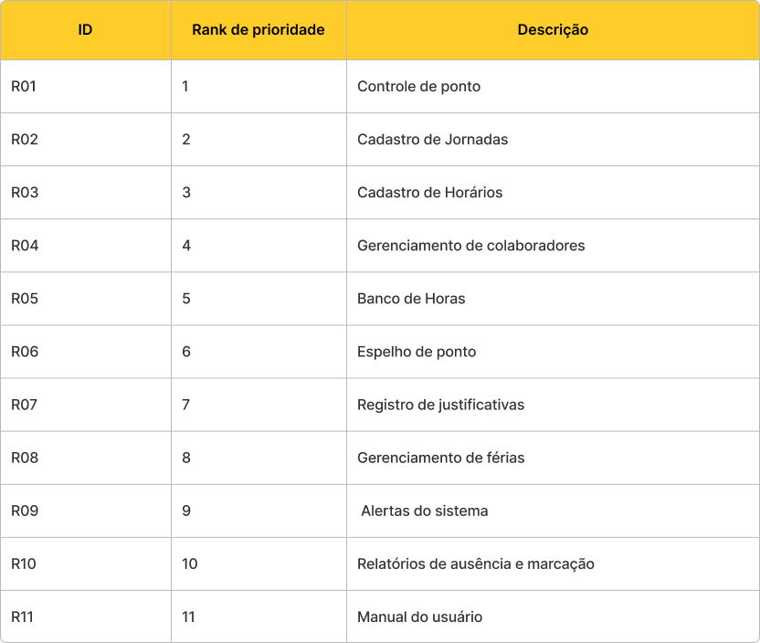
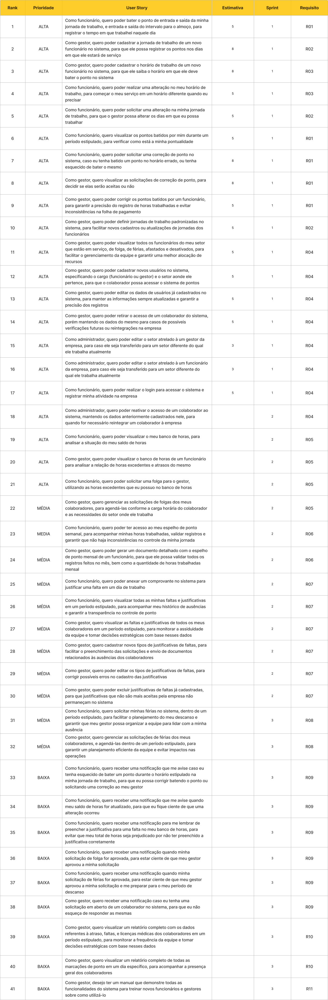

## Visão geral do produto 🖥️

Chronos é uma aplicação web que simplifica o gerenciamento de ponto online, oferecendo funcionalidades completas para controle de jornada de trabalho.
Permite o registro de ponto online, cálculo automático de horas, gestão de ausências e geração de relatórios detalhados.
A interface intuitiva do Chronos facilita o acompanhamento da jornada de trabalho.

---

## Problema do cliente 👔

### Desafios Atuais:

* Controle manual de ponto, sujeito a erros e fraudes.
* Dificuldade no cálculo preciso de horas trabalhadas e extras.
* Falta de visibilidade sobre a jornada de trabalho dos funcionários.
* Processos burocráticos para gestão de ausências.
* Dificuldade na geração de relatórios para análise de dados.
* Não conformidade com a legislação trabalhista.

### Necessidades:

Automatizar o controle de ponto para aumentar a precisão e reduzir erros.
Obter cálculos precisos e automáticos de horas trabalhadas.
Melhorar a visibilidade da jornada de trabalho dos funcionários.
Simplificar a gestão de ausências com fluxos de aprovação.
Gerar relatórios personalizados para análise de dados.
Garantir a conformidade com a legislação trabalhista.

---

## Objetivo do produto 🎯

* Desenvolver uma aplicação web intuitiva e eficiente para o gerenciamento de ponto online.
* Permitir o registro preciso de ponto com diferentes opções.
* Oferecer cálculos automáticos de horas trabalhadas e extras.
* Simplificar a gestão de ausências com fluxos de aprovação.
* Fornecer relatórios detalhados.
* Garantir a segurança dos dados e a conformidade com a legislação.
* permitir o acesso remoto para funcionários e gestores.

---

## Metodologia empregada 💡

Para a confecção do produto foi empregado o framework de [metodologia ágil Scrum](https://aws.amazon.com/pt/what-is/scrum/#:~:text=O%20Scrum%20%C3%A9%20um%20framework,uma%20entrega%20eficiente%20de%20projetos.), que consiste sumariamente dividir o desenvolvimento do projeto em Sprints, um conjunto de tarefas que devem ser executadas e desenvolvidas em um período pré-definido de tempo. Além disso, foi definido o Backlog do Produto, que são todas as funcionalidades que o software deverá ter com base nos requisitos levantados com o cliente. Uma vez aprovado por ele, para selecionar quais seriam as entregas das Sprints do projeto, primeiro foi definido o [MVP](https://rockcontent.com/br/blog/o-que-e-mvp/) de cada Sprint, que é uma versão do produto que prioriza as tarefas que trazem maior entrega de valor para o cliente. Então, a partir disso o Backlog do Produto foi dividido em 4 Backlog de Sprint.

---

## MVP'S 🏆

A tag é obrigatória

---

## Backlog do produto 📖

### Requisitos 📒

### Histórias de usuário 🃏

---

## Relatório e detalhes de cada Sprint 📅

### 🚧 WORK IN PROGRESS 🚧

sprint-1: https://drive.google.com/file/d/1ff7LNQ2wsaeLG8Vm8wrv7Jd8iUDG0kdC/view

---

## Tecnologias 🛠️

  <table>
  <tr>
    <td align="center" width="96">
      
      Figma
    </td>
    <td align="center" width="96">
      
      TailwindCSS
    </td>
    <td align="center" width="96">
      
      TypeScript
    </td>
    <td align="center" width="96">
      
      React
    </td>
    <td align="center" width="96">
      
      NextJS
    </td>
    <td align="center" width="96">
      
      HeroUI
    </td>
    <td align="center" width="96">
      
      Zod
    </td>
    <td align="center" width="96">
      
      Nuqs
    </td>
    <td align="center" width="96">
      
      Java
    </td>
    <td align="center" width="96">
      
      Spring
    </td>
    <td align="center" width="96">
      
      Neon
    </td>
  </tr>
  </table>

---

## Padronização de commits

# Padronização de commit

Cada tipo de commit é referente a como a alteração impacta no projeto, seja por nível de camada, estruturação de arquivos ou ainda histórico dos commits, seguindo o padrão:

|Emoji| |Prefixo|: |Descrição do commit em inglês|

## Tabela de commits

| Tipo de commit                 | Prefixo      | Emoji |
|:-------------------------------|:-------------|:------|
| Camada de domínio              | domain       |  🌐  |
| Camada de API REST             | api          |  🛜  |
| Camada de UI                   | ui           |  🖥️  |
| Camada de banco de dados       | database     |  💾  |
| Camada de fila/mensageria      | queue        |  🎞️  |
| Camada de provedores           | provider     |  ➕  |
| Camada de BFF                  | server       |  📟  |
| Use cases                      | use case     |  ✨  |
| Interfaces                     | interface    |  📑  |
| Documentação                   | docs         |  📚  |
| Correção de bug                | fix          |  🐛  |
| Refatoração de código          | refactor     |  ♻️  |
| Configuração/infraestrutura    | config       |  ⚙️  |
| Dependências                   | deps         |  📦  |
| Arquivos estáticos             | assets       |  🎴  |
| Merge de branches              | merge        |  🔀  |
| Reset de histórico de commits  | revert       |  ⏪  |
| Estruturação de pastas/arquivos| ftree        |  🗃️  |
| Certificados e licenças        | cert         |  📜  |
| Trabalho não finalizado        | wip          |  🚧  |

## Como Executar Localmente no Windows 🖥️

### 🚧 WORK IN PROGRESS 🚧

## Time de Desenvolvimento 👷🏻

| Foto | Nome | Função | Github | Linkedin |
| :--: | :--: | :--: | :--: | :--: |
|  | Joao Pedro Carvalho | Scrum Team |  |  |
|  | Thiago Martins | Scrum Team |  |  |
|  | Kauan Fonseca do Vale | Scrum Team |  |  |
|  | Rafael dos Santos | Scrum Master |  |  |
|  | Gabriel Oliveira | Scrum Team |  |  |
|  | Joao Gabriel Oliveira | Product Owner |  |  |
|  | Eduardo Kuwahare Junior | Scrum Team |  |   
